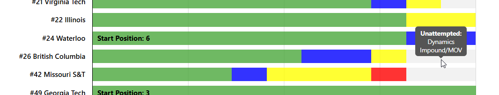
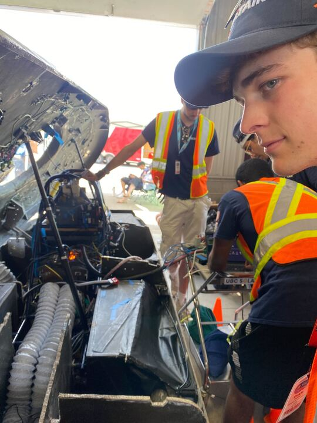

**Alex Ezzat** Wednesday, July 2 11:14 PM  
whats happening with lights/mechanical/electrical?

FSGP website says you're blue/yellow and havent tried dynamics - but i saw you guys trying slalom/braking today

**Christopher Kalitin** Wednesday, July 2 11:42 PM  
Lights was a brightness issue and we removed resistors to solve it. Instead of 95 ohm + ~500 ohm we only have the 95 ohm now for lights. This is passed for fsgp.

Mechanical blue is play in the steering wheel. Can wiggle it side to side. Fine for fsgp either way either way blue.

Electrical yellow is sealing the pack, doing this tonight I think (scrutineer in the bay behind me rn). Maybe finishing tomorrow morning.

Dynamics is wet break testing. Our motor barely worked the entire day. Among other things, the final issue was getting inconsistent CAN/power from the motor interface board. Was difficult to debug but in the end it was completely obvious that it was the cable that was the issue.

Fixed the cable couple hours ago and the car is good to go for tomorrow morning wet break testing if scrutineers are available. Should be driving early.

Also, I’ve suggested many times to Saman talking to all the old solar guys after comp to review (Mischa, Hanlon, you, Ishan, etc for elec). Particularly talk about slave board issues.

A call would be very useful in a couple weeks. Maybe something for new members too.

**Alex Ezzat** Wednesday, July 2 11:54 PM  
Very down for call

Glad you guys have been able to debug so far. Good luck tmrw

**Alex Ezzat** Wednesday, July 2 11:54  
I’m watching and rooting for yall

**Christopher Kalitin** Wednesday, July 2 11:58 PM  
Hell yea, we’re gonna make it!!!

**Alex Ezzat** Thursday, July 3 2:49 PM  
Still not on the track??

**Christopher Kalitin** Thursday, July 3 2:52 PM  
Just passed wet break testing, had issues with motor all day where it’d go into stop state randomly and ECU connector issues.Need to charge then seal battery then drive. Should get laps in today. Still room to beat the laps last year.

**Alex Ezzat** Thursday, July 3 2:54 PM  
Sick

**Alex Ezzat** Friday, July 4 7:01 PM  
Did you guys fry the motor

**Christopher Kalitin** Friday, July 4 10:05 PM  
YO HAPPY FOURTH OF JULY

Editors note: I was drunk and wishing everyone a happy fourth of July around here.

**Christopher Kalitin** Friday, July 4 10:06  
Will explain tomorrow morning for reasons I can’t explain but it’s working now

**Christopher Kalitin** Saturday, July 5 1:37 AM  
Motor power wires were rubbing against the rotor. Extremely simple and deadly mistake.

We took apart the motor last night and cleaned the plastic off with IPA. Meanwhile, we got an extra Motor from U of T and put it in the car.

We spent this morning debugging issues with it. In the end, the hall sense lines weren’t matched with the motor power phase lines. The behaviour we saw is it quickly jittering back and forth.

After trying each possible combination of Hall effect sensor wires to the motor controller, we found one where it spins the way we expect.

**Christopher Kalitin** Saturday, July 5 1:39 AM  
We got 24% impedance factor on the new motor vs 22% on the other. Tons of help from scurtineers debugging throughout the day really set us on the right path.

Fundamentally, this was a skill issue for not understanding fundamentally how the motor works for most of the day (scrutineers invaluable here), and also for no one noticing that the wire was rubbing on the rotor.

**Christopher Kalitin** Saturday, July 5 1:40 AM  
These are my notes from after the drive, if you’re interested:

Back in bay after driving:

Saman heard the banging when we were getting on the track.

A bolt on the motor (I think) was hitting the wire causing the banging.

The motor wire was rubbing on the inside coil (coil rotates, inductor in the middle is stator).

5-10 minutes between car moving, then it crept extremely slowly. Checks out that it’s temperature.

I put my hand on the inside of the back bulkhead when in bay at least 20 minutes after  off the track and it was still hot.

We didn’t have telemetry, Aarjav was attempting to debug on his laptop right before. I’ve got pictures.

Motor has thermistors. We saw motor fault later. See video.

Alex (editors note: Alex Malkowski, mech lead, not Alex Ezzat, former captain) heard it while driving onto the track too, Saman says he said it’s just a hinge.

Imagine scrapping the first lap for a noise like that. Difficult to convince people, especially when we wanted to get down to 70% SOC for strategy then charge during evening and tomorrow morning.

Saman says the banging issues was actually the wire plastic wrapping around the motor wires hitting the motor.

Important to note that we really wanted to drive it into the pit and kept trying for a long while, then a scrutineer commanded us to while some of us were already on the way to get a safety car (van).

Data to look at:
Motor current, pack current, motor faults, battery faults, events surrounding all faults, motor temperature, battery and mppt temps.

Julie (Ibrahimova, captain) looking for extra Mitsuba 2096 D3

Aum:
While rolling onto the track SOC was 99-100%. At some point it was stuck at 102%. Then, first power cycle and it became 91% and was consistently there after more power cycles.

**Alex Ezzat** Saturday, July 5 11:41 AM  
Rough. Lmk if you guys wanna do some motor theory lessons when you’re back lol

**Christopher Kalitin** Saturday, July 5 12:20 PM  
Lmao yes absolutelyReally we need members who understand every component of the vehicle before comp. Too much learning in the last few days, not enough inference.Faster iteration cycle seems to solve this